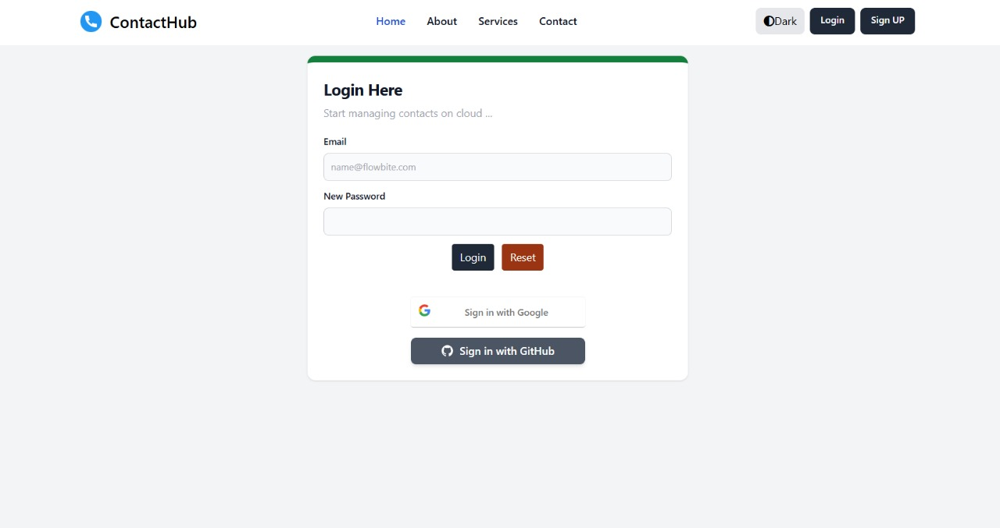

<p align="center">
  
</p>

<h1 align="center">ContactHub</h1>

<p align="center">
  <a href="https://github.com/Pawan-Pandey1/Contact-Hub"></a>
  <a href="https://github.com/Pawan-Pandey1/Contact-Hub/blob/main/LICENSE"></a>
  <a href="https://github.com/Pawan-Pandey1/Contact-Hub"></a>
</p>

<p align="center">
  <b>Modern, full-stack web application for secure and efficient contact management.</b><br>
  Easily add, edit, organize, and search your contacts from any device, with a beautiful and intuitive interface.
</p>

---

## Table of Contents

- [Features](#features)
- [Screenshots](#screenshots)
- [Technologies Used](#technologies-used)
- [Getting Started (All Commands)](#getting-started-all-commands)
- [Usage](#usage)
- [Documentation & Resources](#documentation--resources)
- [Contributing](#contributing)
- [License](#license)
- [Acknowledgements](#acknowledgements)

---

## Features

- User Registration & Authentication (Email, Google, GitHub)
- Add, Edit, Delete, and View Contacts
- Profile Management
- Advanced Search and Filtering
- Responsive UI with Light/Dark Mode
- Secure Data Storage (Hibernate, MySQL)
- Contact Exporting
- Role-based Access Control
- Deployed on AWS

---

## Screenshots

### Home Page


### Signup Page


### Login/Signup Page


### Profile Page


### User Dashboard


### Add New Contact Page


### All User contacts Page 


### View Contact Details Page


### User Feedback Page


---

## Technologies Used

- **Backend:** Java, Spring Boot, Spring MVC, Spring Security, Hibernate, JPA
- **Frontend:** Thymeleaf, HTML, CSS, Tailwind CSS, JavaScript
- **Database:** MySQL
- **Authentication:** Spring Security, OAuth (Google, GitHub)
- **Deployment:** Maven, AWS
- **Validation:** JSR-380 Bean Validation
- **Build Tools:** Spring Boot Maven Plugin, DevTools

---

## Getting Started (All Commands)

```bash
# 1. Clone the repository
git clone https://github.com/Pawan-Pandey1/Contact-Hub.git
cd Contact-Hub

# 2. Configure the MySQL database in application.properties
spring.datasource.url=jdbc:mysql://localhost:3306/contacthub
spring.datasource.username=YOUR_DB_USERNAME
spring.datasource.password=YOUR_DB_PASSWORD

# 3. Install backend dependencies
mvn clean install

# 4. Run the application
mvn spring-boot:run
# App will be available at: http://localhost:8080

# 5. (Optional) Build Tailwind CSS assets
npm install
npx tailwindcss -i ./src/main/resources/static/css/input.css -o ./src/main/resources/static/css/output.css --watch
```

### Tailwind CSS Configuration

```js
// tailwind.config.js
export default {
  content: [
    "./src/main/resources/templates/**/*.{html,js,thymeleaf}",
    "./src/main/resources/static/**/*.{js,ts}"
  ],
  theme: {
    extend: {},
  },
  plugins: [],
  darkMode: "class",
};
```

---

## Usage

- Register using email or social login
- Access dashboard
- Add, edit, delete contacts
- Search and export contacts
- Manage your profile and preferences

---

## Documentation & Resources

- [Spring Boot Docs](https://docs.spring.io/spring-boot/docs/current/reference/html/)
- [Thymeleaf Docs](https://www.thymeleaf.org/documentation.html)
- [Tailwind CSS Docs](https://tailwindcss.com/docs/)
- [Maven Guide](https://maven.apache.org/guides/)
- [JPA Access Guide](https://spring.io/guides/gs/accessing-data-jpa/)
- [Spring Security Guide](https://spring.io/guides/topicals/spring-security-architecture/)
- [HELP.md](https://ppl-ai-file-upload.s3.amazonaws.com/web/direct-files/attachments/54673271/2973b408-aea0-4fee-91e6-e79617374859/HELP.md)

---

## Contributing

```bash
# Fork this repo and create a new branch
git checkout -b feature/your-feature

# Make changes and commit
git commit -am 'Add some feature'

# Push to your branch
git push origin feature/your-feature

# Submit a pull request on GitHub
```

---

## License

This project is licensed under the MIT License.  
See [LICENSE](https://github.com/Pawan-Pandey1/Contact-Hub/blob/main/LICENSE) for details.

---

## Acknowledgements

- Inspired by [LearnCodeWithDurgesh/scm2.0](https://github.com/LearnCodeWithDurgesh/scm2.0)
- Built using Spring Boot, Thymeleaf, and Tailwind CSS

**🔗 Project Link:** [https://github.com/Pawan-Pandey1/Contact-Hub](https://github.com/Pawan-Pandey1/Contact-Hub)
