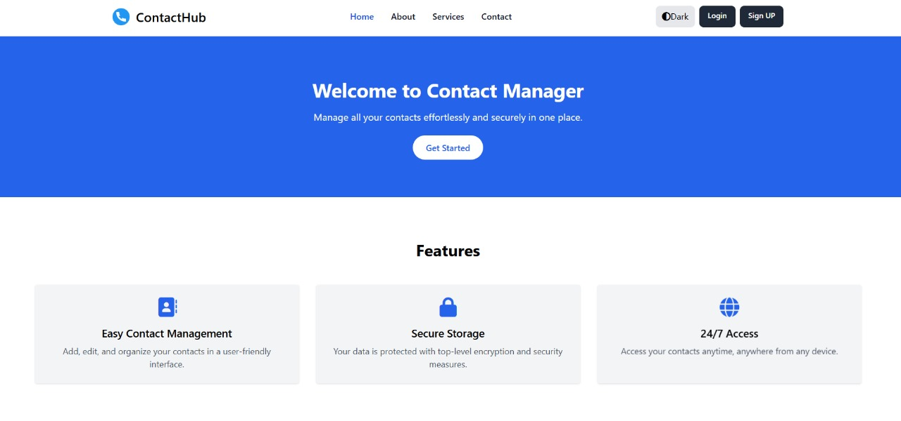
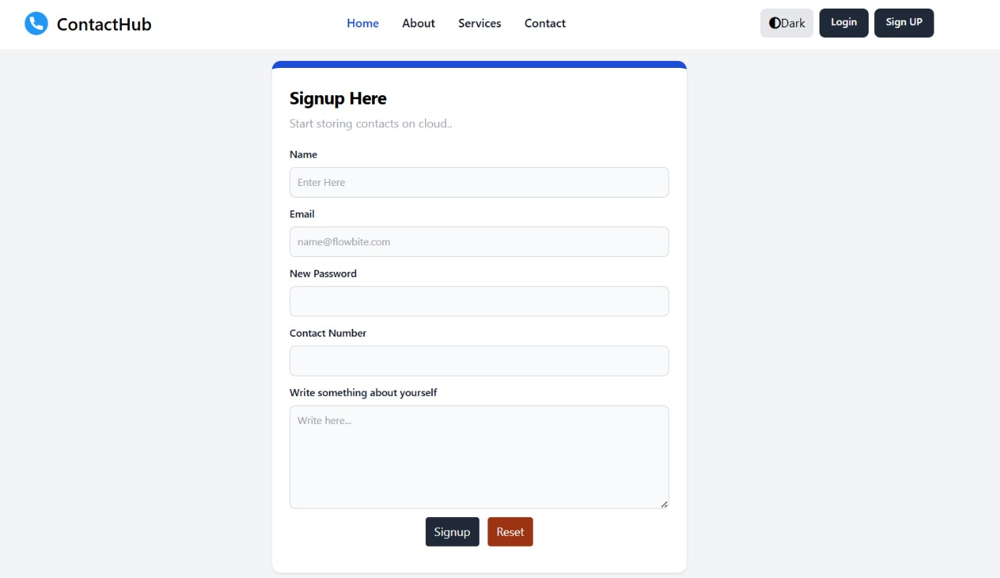
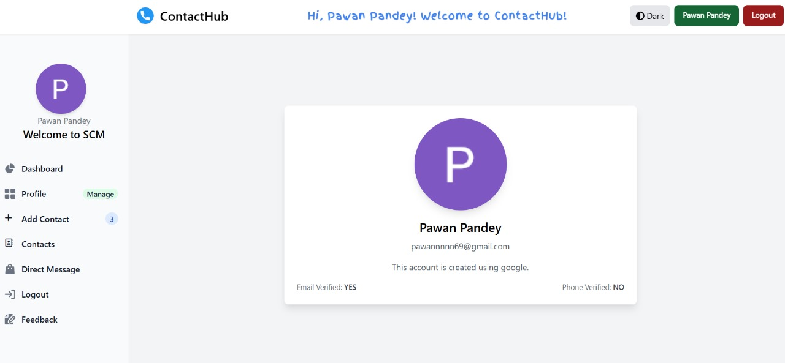
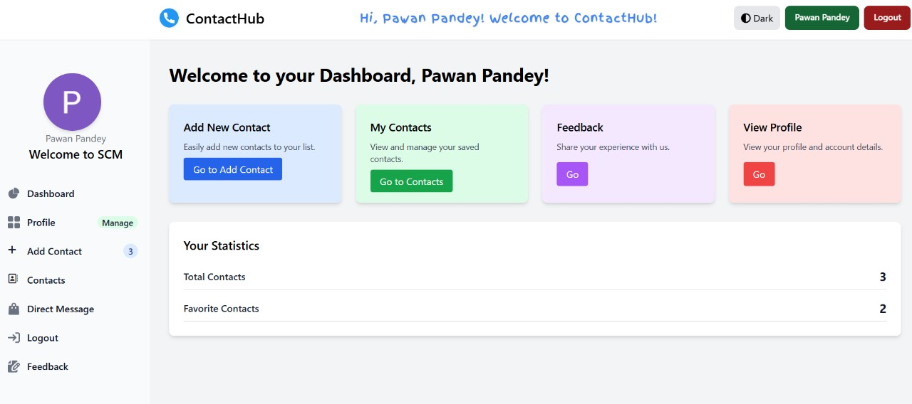
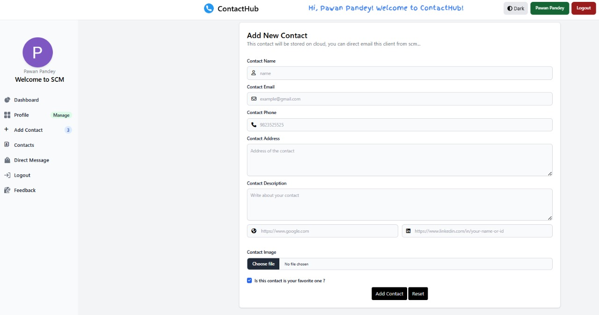
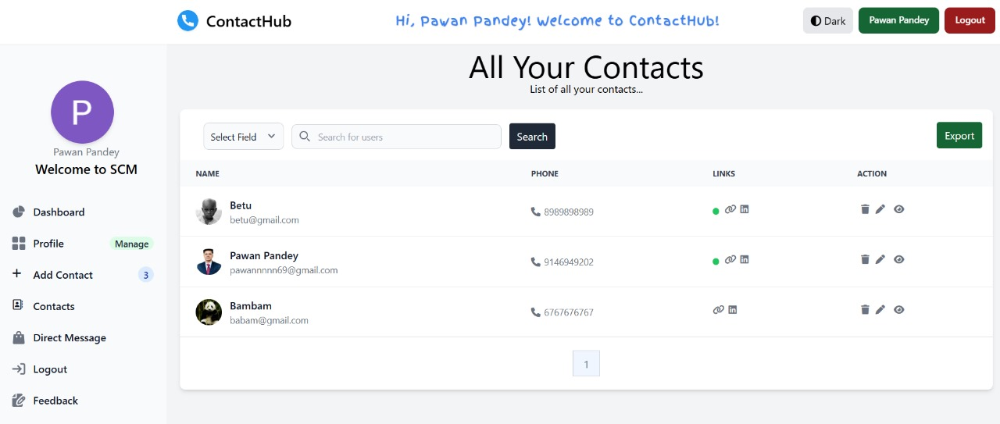
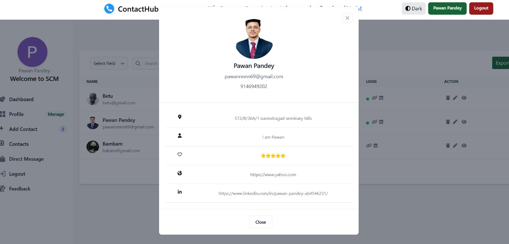
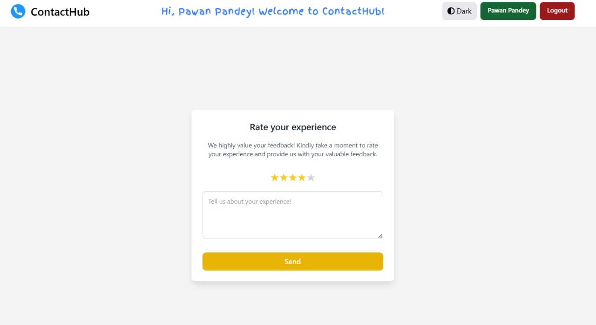

<p align="center">
  
</p>

<h1 align="center">Smart Contact Manager</h1>

<p align="center">
  <a href="https://github.com/Pawan-Pandey1/Contact-Hub"></a>
  <a href="https://github.com/Pawan-Pandey1/Contact-Hub"></a>
</p>

<p align="center">
  <b>Modern, full-stack web application for secure and efficient contact management.</b><br>
  Easily add, edit, organize, and search your contacts from any device, with a beautiful and intuitive interface.
</p>

---

## Table of Contents

- [Features](#features)
- [Screenshots](#screenshots)
- [Technologies Used](#technologies-used)
- [Getting Started (All Commands)](#getting-started-all-commands)
- [Usage](#usage)
- [Documentation & Resources](#documentation--resources)
- [Contributing](#contributing)
- [Acknowledgements](#acknowledgements)

---

## Features

- User Registration & Authentication (Email, Google, GitHub)
- Add, Edit, Delete, and View Contacts
- Profile Management
- Advanced Search and Filtering
- Responsive UI with Light/Dark Mode
- Secure Data Storage (Hibernate, MySQL)
- Contact Exporting

---

## Screenshots

### Home Page



### Signup Page

The signup page allows users to register either through a traditional form or using social logins. We used **HTML and CSS** to design the UI and implemented the backend in **Spring Boot** using **Spring Security**. Users can register using:
- Standard email and password
- Google or GitHub via **OAuth2**

Each registered user is associated with their own set of contacts using **JPA joins**, enabling personalized data storage. Upon signup, user details are stored securely, and their role and verification status are tracked.


### Login/Signup Page

The login page enables users to securely access their accounts using:
- Email and password
- Social logins via **Google** or **GitHub** using **OAuth2**

We’ve implemented **Spring Security** to manage authentication and protect routes. The login flow ensures only verified and authorized users can access the dashboard and contact data. The UI is responsive and consistent with the overall app design.


### Profile Page

The profile page displays personalized information of the logged-in user:
- **Full name**
- **Login method** (Google, GitHub, or standard registration)
- **Email verification status** (highlighted for clarity)

This page is dynamically generated using Thymeleaf and backed by Spring Boot. It retrieves user session data from Spring Security context. This transparency helps users manage their identity and account method in one place.


### User Dashboard

The profile page displays personalized information of the logged-in user:
- **Full name**
- **Login method** (Google, GitHub, or standard registration)
- **Email verification status** (highlighted for clarity)

This page is dynamically generated using Thymeleaf and backed by Spring Boot. It retrieves user session data from Spring Security context. This transparency helps users manage their identity and account method in one place.


### Add New Contact Page

The add contact page allows users to store detailed information for each contact, including:
- Name, Email, Phone Number
- Description & Profile Image
- Social Media Links (LinkedIn, Twitter, etc.)
- Favorite flag (to mark important contacts)

Each contact is linked to the currently authenticated user through **JPA joins**, ensuring data isolation and secure CRUD operations. Image uploads and validation are also supported.


### All User contacts Page 


### View Contact Details Page

This page shows all saved contacts in the form of cards with quick access to:
- View full details
- Edit or Delete contacts via action icons
- Search contacts by **name, email, or phone**
- Navigate across pages using pagination for large contact lists

The layout is built for responsiveness and ensures users can find and manage their contacts efficiently.


### User Feedback Page

User feedback is essential for continuous improvement. The feedback page includes:
- A form to collect suggestions, issues, or general feedback
- Input fields for name, email, and message
- Server-side validation to ensure quality feedback

The submitted data can be reviewed by admins or stored for product enhancement decisions. It reflects the application's user-centric approach.

---

## Technologies Used

- **Backend:** Java, Spring Boot, Spring MVC, Spring Security, Hibernate, JPA
- **Frontend:** Thymeleaf, HTML, CSS, Tailwind CSS, JavaScript
- **Database:** MySQL
- **Authentication:** Spring Security, OAuth (Google, GitHub)
- **Deployment:** Maven, AWS
- **Validation:** JSR-380 Bean Validation
- **Build Tools:** Spring Boot Maven Plugin, DevTools

---

## Getting Started (All Commands)

```bash
# 1. Clone the repository
git clone https://github.com/Pawan-Pandey1/Contact-Hub.git
cd Contact-Hub

# 2. Configure the MySQL database in application.properties
spring.datasource.url=jdbc:mysql://localhost:3306/contacthub
spring.datasource.username=YOUR_DB_USERNAME
spring.datasource.password=YOUR_DB_PASSWORD

# 3. Install backend dependencies
mvn clean install

# 4. Run the application
mvn spring-boot:run
# App will be available at: http://localhost:8080

# 5. (Optional) Build Tailwind CSS assets
npm install
npx tailwindcss -i ./src/main/resources/static/css/input.css -o ./src/main/resources/static/css/output.css --watch
```

### Tailwind CSS Configuration

```js
// tailwind.config.js
export default {
  content: [
    "./src/main/resources/templates/**/*.{html,js,thymeleaf}",
    "./src/main/resources/static/**/*.{js,ts}"
  ],
  theme: {
    extend: {},
  },
  plugins: [],
  darkMode: "class",
};
```

---

## Usage

- Register using email or social login
- Access dashboard
- Add, edit, delete contacts
- Search and export contacts
- Manage your profile and preferences

---

## Documentation & Resources

- [Spring Boot Docs](https://docs.spring.io/spring-boot/docs/current/reference/html/)
- [Thymeleaf Docs](https://www.thymeleaf.org/documentation.html)
- [Tailwind CSS Docs](https://tailwindcss.com/docs/)
- [Maven Guide](https://maven.apache.org/guides/)
- [JPA Access Guide](https://spring.io/guides/gs/accessing-data-jpa/)
- [Spring Security Guide](https://spring.io/guides/topicals/spring-security-architecture/)
- [HELP.md](https://ppl-ai-file-upload.s3.amazonaws.com/web/direct-files/attachments/54673271/2973b408-aea0-4fee-91e6-e79617374859/HELP.md)

---

## Contributing

```bash
# Fork this repo and create a new branch
git checkout -b feature/your-feature

# Make changes and commit
git commit -am 'Add some feature'

# Push to your branch
git push origin feature/your-feature

# Submit a pull request on GitHub
```

## Acknowledgements

- Inspired by [LearnCodeWithDurgesh/scm2.0](https://github.com/LearnCodeWithDurgesh/scm2.0)
- Built using Spring Boot, Thymeleaf, and Tailwind CSS

**🔗 Project Link:** [https://github.com/Pawan-Pandey1/Contact-Hub](https://github.com/Pawan-Pandey1/Contact-Hub)
